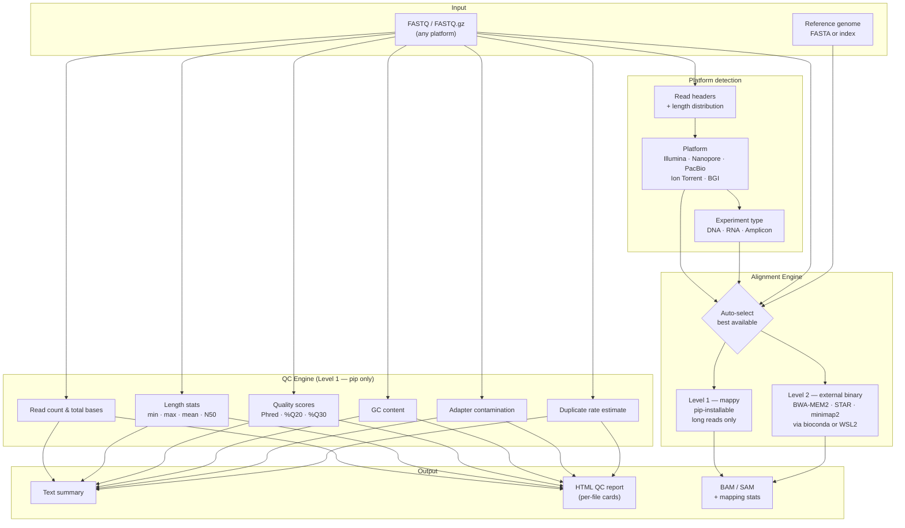
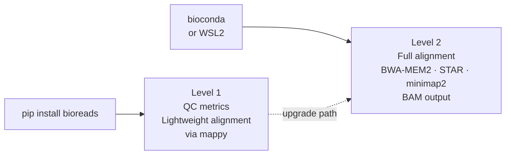

# BioReads

[](LICENSE)
[](https://www.python.org/)
[](#supported-platforms)

NGS quality control and alignment for Illumina, Nanopore, PacBio, Ion Torrent, and BGI. Auto-detects your platform, computes read quality metrics, and selects the right aligner automatically.

---

## How it works



---

## Supported platforms

| Platform | Read type | DNA aligner | RNA aligner |
|---|---|---|---|
| Illumina (HiSeq, NovaSeq, MiSeq) | Short | BWA-MEM2 | STAR |
| Oxford Nanopore (ONT) | Long | minimap2 `-x map-ont` | minimap2 `-x splice` |
| PacBio HiFi (CCS) | Long | minimap2 `-x map-hifi` | minimap2 `-x splice:hq` |
| Ion Torrent | Short | BWA-MEM2 | BWA-MEM2 |
| BGI / DNBSEQ | Short | BWA-MEM2 | STAR |

---

## Two operation levels



BioReads detects which level is available and works with what it finds. The `bioreads check-tools` command shows the current status.

---

## QC metrics

| Metric | Description |
|---|---|
| Total reads & bases | Raw read count and base count |
| Length min / max / mean / N50 | Read length distribution |
| Mean Phred Q | Average base quality score |
| % bases >= Q20 | Fraction of reliable bases |
| % bases >= Q30 | Fraction of high-confidence bases |
| GC content | Global GC percentage |
| Adapter contamination | Detection of common Illumina adapters |
| Duplicate rate | Estimate from first 50 bp fingerprints |

---

## Installation

```bash
pip install bioreads
```

For full alignment support (Level 2), install BWA-MEM2, STAR, or minimap2 via bioconda:
```bash
conda install -c bioconda bwa-mem2 star minimap2
```

---

## Usage

### GUI
```bash
bioreads gui
```

### CLI — quality control
```bash
# Auto-detect platform
bioreads qc reads.fastq

# Specify platform explicitly
bioreads qc reads.fastq --platform nanopore

# Detect platform only
bioreads detect reads.fastq

# Check installed aligners
bioreads check-tools
```

### CLI — alignment
```bash
# DNA — Illumina paired-end
bioreads align reads_R1.fastq genome.fa \
  --platform illumina --experiment dna \
  --reads2 reads_R2.fastq --output aligned.bam

# RNA — Nanopore direct RNA
bioreads align reads.fastq genome.fa \
  --platform nanopore --experiment rna \
  --output aligned.bam
```

### Python library
```python
from bioreads import QCEngine, AlignmentEngine

# Quality control
engine = QCEngine()
result = engine.run("reads.fastq", platform="illumina")

print(result.total_reads)    # 1_500_000
print(result.pct_q30)        # 87.3
print(result.n50)            # 150
print(result.summary())      # full text report

# Alignment — auto-selects best available aligner
engine = AlignmentEngine.auto(platform="nanopore", experiment="dna")
print(engine.available_level)   # 1 or 2

result = engine.align(
    reads="reads.fastq",
    reference="genome.fa",
    output="aligned.bam",
)
print(result.mapping_rate)   # 94.3
```

---

## Part of the Bio* ecosystem

BioReads is designed to work alongside the other tools in the same ecosystem:

```
BioFetch  →  downloads data from 8 public databases
BioCheck  →  validates downloaded or locally generated files
BioReads  →  QC and alignment for NGS sequencing data   ← you are here
```

---

## License

MIT — free to use, modify, and distribute with attribution.
See [LICENSE](LICENSE) for details.
